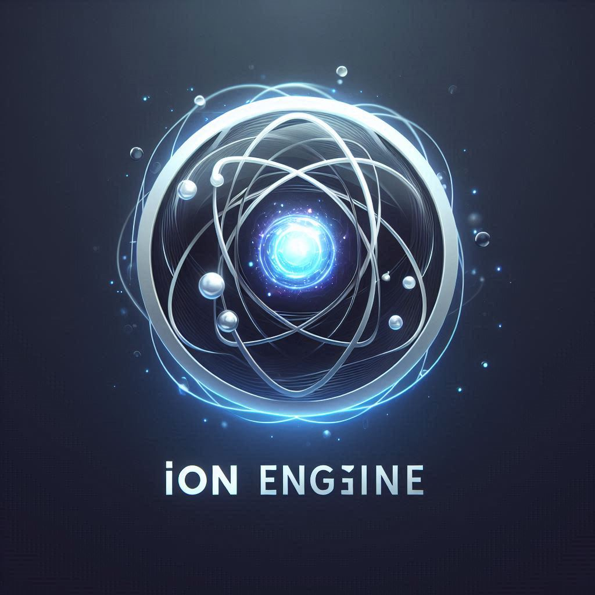

# IonEngine

IonEngine is an open source Game Engine that is heavily based on Unity. Sporting a Editor that is very similar to the Unity editor, the switch from Unity to IonEngine should be relatively smooth. 

# Please Watch the Latest Update video

This engine consists of:
- C++ host language that is the backbone of the engine and the editor
- Lua, a light weight fast scripting language that is used for game logic
- GLM, used for vector and matrix math—crucial for transforms, physics, and rendering.
- LuaBridge, A lightweight library that simplifies binding C++ classes and functions to Lua.
- SDL, A cross-platform library for managing input, windowing, audio, and rendering contexts.
- Box2D, A 2D physics simulation library widely used in games that simulates rigid body dynamics, including collision detection and response.
- Dear ImGui, The backbone to the Editor used in IonEngine
- RapidJSON, the main method of saving and storing game data
